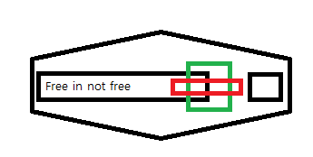

<!DOCTYPE html>
<html>
<head>
<meta charset="UTF-8">
<title>class</title>
</head>
<body>
<table border="40" width=1890 heigh=500>
<thead>
<tr>
<td rowspan="4"><h1><strong>B</strong></h1>&emsp;&emsp;&emsp;&emsp;
            
<h1><strong>e</strong></h1></td>
<td colspan="2">
<h1>
&emsp;&emsp;&emsp;&emsp;&emsp;&emsp;
&emsp;&emsp;&emsp;&emsp;&emsp;&emsp;
&emsp;&emsp;&emsp;&emsp;&emsp;&emsp;&emsp;&emsp;&emsp;&emsp;&emsp;
<a href="1.html">Hey</a></h1></td>
<td rowspan="4">&emsp;&emsp;&emsp;&emsp;<h1><strong>W</strong></h1>
      
<h1><strong>h</strong></h1>
      
<h1><strong>y</strong></h1></td>
</tr>
<tr>
<td>
<strong>free</strong>is not free

<pre>                                         </pre>

<h3>
<a href="https://en.wikipedia.org/wiki/Freedom_isn%27t_free" target="_blank" title="더 많은 정보">more</a>
</h3>
<ul>
<li><a href="https://www.youtube.com/watch?v=ckZor7HRU1E" target="_blank">가라사대</a></li>
<li><a href="https://www.youtube.com/watch?v=8WbFtP2Rl4Y" target="_blank">초월</a></li>
<li><a href="https://www.youtube.com/watch?v=8WYF4uuBCik" target="_blank">찬란</a></li>
</ul>
<ul>
<li><a href="2.html" target="_blank">가라사대</a></li>
<li><a href="3.html" target="_blank">초월</a></li>
<li><a href="4.html" target="_blank">찬란</a></li>
</ul>
<td>
 
<audio src="audio.mp3" controls autoplay>
</audio></td>
</tr>
<tr>
<td colspan="2">
<table border="100">
<thead>
<tr><th>가라사대</th><th>초월</th><th>찬란</th></tr>
</thead>
<tbody>
<tr><td>비와이 가라사대</td><td>초월한다</td><td>찬란하다</td></tr>
<tr>
<td><a href="https://www.youtube.com/watch?v=ckZor7HRU1E" target="_blank">가라사대</a></td>
<td><a href="https://www.youtube.com/watch?v=8WbFtP2Rl4Y" target="_blank">초월</a></td>
<td><a href="https://www.youtube.com/watch?v=8WYF4uuBCik" target="_blank">찬란</a></td>
</tr>
</tbody>
<tfoot>
<tr><td colspan="3"></td></tr>
</tfoot>
</table>
</td>
</tr>
<tr>
<td><form action="http://localhost/login.php">

아이디&nbsp;&nbsp;&nbsp;<input type="text" name=id value="입력하세요">

비밀번호<input type="password" name=pwd>

 

<select name=비와이>

<option value="가라사대">가라사대</option>

<option value="초월">초월</option>

<option value="찬란">찬란</option>

</select>

 
<select name=Be multiple>

<option value="가라사대">가라사대</option>

<option value="초월">초월</option>

<option value="찬란">찬란</option>

</select>

&emsp;&emsp;&emsp;&emsp;&emsp;
<input type=radio name="Be" value="B">가라사대</option>
<input type=radio name="Be" value="e">초월</option>
<input type=radio name="Be" value="w">찬란</option>

&emsp;&emsp;&emsp;&emsp;&emsp;
<input type=radio name="Why" value=h>비와이 가라사대</option>
<input type=radio name="Why" value=y>초월한다</option>
<input type=radio name="Why">찬란하다</option>

 
&emsp;&emsp;&emsp;&emsp;&emsp;
<input type=checkbox name=W>가라사대
<input type=checkbox name=h>초월
<input type=checkbox name=y>찬란

&emsp;&emsp;&emsp;&emsp;&emsp;

<input type="submit">

<input type="button" value="BeWhy">
</select>

</form>
</td>
<td><form action="http://iocalhost/hidden.php">
<input type="hidden" name=Be value="Why">

<label for=Bewhy>아이디</label>&nbsp;&nbsp;&nbsp;<input id=Bewhy type="text" name=id value="입력하세요">

<lable>비밀번호</lable><input type="password" name=pwd>

<input type="submit">
</form></td>
</tr>
</thead>
</table>
</body>
</html>
